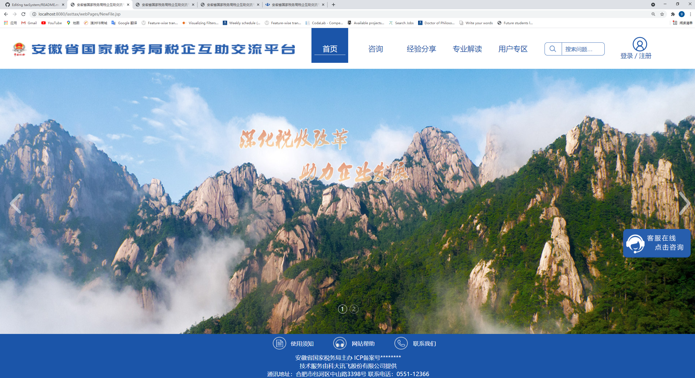

<!--
*** Thanks for checking out the Best-README-Template. If you have a suggestion
*** that would make this better, please fork the repo and create a pull request
*** or simply open an issue with the tag "enhancement".
*** Thanks again! Now go create something AMAZING! :D
-->


<!-- PROJECT SHIELDS -->
<!--
*** I'm using markdown "reference style" links for readability.
*** Reference links are enclosed in brackets [ ] instead of parentheses ( ).
*** See the bottom of this document for the declaration of the reference variables
*** for contributors-url, forks-url, etc. This is an optional, concise syntax you may use.
*** https://www.markdownguide.org/basic-syntax/#reference-style-links
-->


<!-- PROJECT LOGO -->
<br />
<p align="center">


  <h3 align="center">Tax-Forum-System</h3>

  <p align="center">
    A primary version of Anhui Provincial Tax Service Website's communication part. 
    <br />
    <a href="http://anhui.chinatax.gov.cn/col/col9418/index.html"><strong>Explore current website. »</strong></a>
    <br />
    <br />

  </p>
</p>


<!-- TABLE OF CONTENTS -->
<details open="open">
  <summary>Table of Contents</summary>
  <ol>
    <li>
      <a href="#about-the-project">About The Project</a>
      <ul>
        <li><a href="#built-with">Built With</a></li>
      </ul>
    </li>
    <li>
      <a href="#getting-started">Getting Started</a>
      <ul>
        <li><a href="#prerequisites">Prerequisites</a></li>
        <li><a href="#installation">Installation</a></li>
      </ul>
    </li>


  </ol>
</details>


<!-- ABOUT THE PROJECT -->
## About The Project



This is a Tax Forum Website System finished in 2018, during my summor internship in Shandong University Website Labortory, in a group of four. I majorred in the back-end. This website is the primary version of Anhui Provincial Tax Service Weibsite's communication part, aims to help small and medium-sized enterprises conduct financial consulting and experience exchanges. 

The functions include:
* Users register and login, website managers (administrators) authority.  
* Users can communicate between users via messaging, posting, replying to posts. Users can ask questions to experts for replies. 
* Managers can edit can delete users' posts and replies. Manager can edit users' access and block users who behave illegally.


### Built With

This section should list any major frameworks that you built your project using. Leave any add-ons/plugins for the acknowledgements section. Here are a few examples.
* [Java Server Page (JSP)](https://www.oracle.com/java/technologies/jspt.html)
* [HTML5](https://html5.org/)
* [Tomcat 7.0](http://tomcat.apache.org/)
* [MySQL](https://www.oracle.com/au/mysql/)


<!-- GETTING STARTED -->
## Getting Started

This is an example of how you may give instructions on setting up your project locally.
To get a local copy up and running follow these simple example steps.

### Prerequisites

Install the prerequisites
* Install Tomcat 7.0 and IDE (eg. Eclipse)
* Install Oracle MySQL

### Installation

1. GET your IDE ready with Topcat 7.0
2. Clone the repo
   ```sh
   git clone https://github.com/gszswork/taxSystem.git
   ```
3. Link your MySQL database on and load the database.
4. Run the project on Server


<!-- LICENSE -->
## License

Distributed under the MIT License. See `LICENSE` for more information.


<!-- CONTACT -->
## Contact

Your Name - danielkung1997@gmail.com

Project Link: [https://github.com/gszswork/taxSystem](https://github.com/gszswork/taxSystem)


